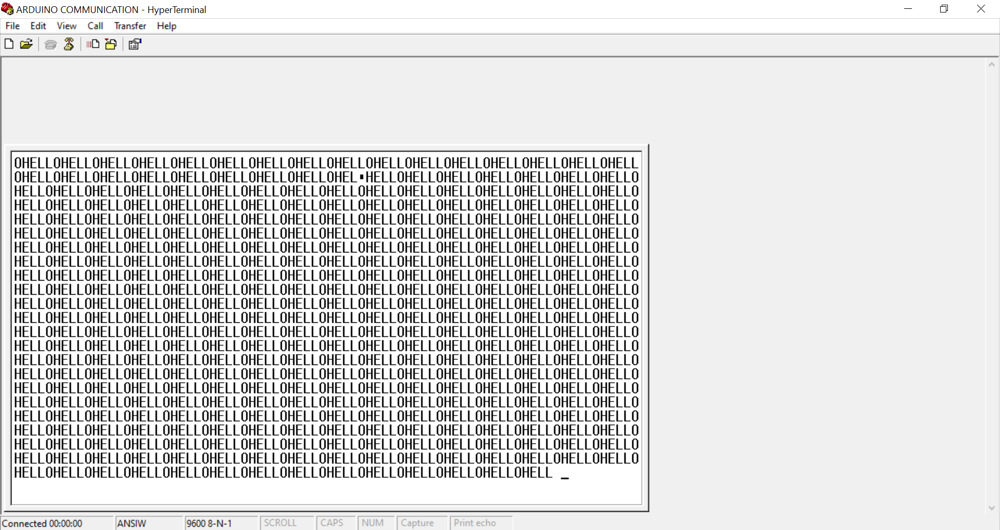

### UART
Send the word 'Hello' to a device connected via uart. 
HyperTerminal is used to view the data in place of a uart connected device 

### HyperTerminal settings
1. Baud Rate - 9600 
2. Stop bits - 1 
3. Parity bit - None 
4. Data bits - 8 
5. Flow Control - None 

